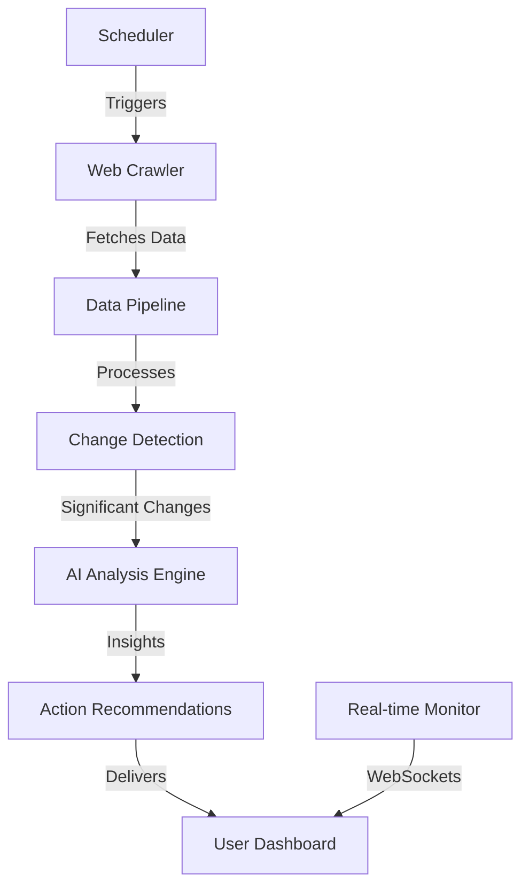

# Real-Time Competitor Analysis: The Architecture Behind CompetitorScope

## The Genesis: Why Another Competitor Analysis Tool?

As a marketing professional, I've spent countless hours manually checking competitor websites, taking screenshots, copying their headlines, and trying to reverse-engineer their strategies. Every Monday morning started the same way: open 15 tabs, check what changed, update spreadsheets, and hope I didn't miss anything important.

The existing tools? They were either:
- **Too expensive**: $500-2000/month for enterprise solutions
- **Too shallow**: Just showing backlinks and keywords
- **Too complex**: Built for SEO experts, not marketers
- **Too slow**: Weekly or monthly updates when competitors move daily

I knew there had to be a better way. That's when I discovered [Claude Code](https://claude.ai/code) and realized I could build exactly what I needed without being a traditional developer.

## The Vision: Real-Time Intelligence for Modern Marketers

CompetitorScope was born from a simple idea: **What if you could know about competitor changes the moment they happen?**

Not just domain-level metrics, but actual intelligence:
- When they update their pricing
- When they launch new features
- When they change their messaging
- When they publish new content
- When their performance improves

And most importantly: **What you should do about it.**

## The Technical Journey: From Marketer to Builder

### Starting with Claude Code

Here's the thing - I'm not a developer. I'm a marketer who understands what needs to be built but not necessarily how to build it. Claude Code changed that completely.

My first conversation with Claude Code went something like this:

```
Me: "I want to build a tool that monitors competitor websites 
and tells me when important things change. It should use AI 
to understand what's important, not just track everything."

Claude Code: "Let's build a real-time competitor intelligence 
platform. We'll need a web crawler, change detection system, 
AI analysis pipeline, and a dashboard. Here's how we'll 
architect it..."
```

And just like that, we were building.

### The Architecture That Emerged

Claude Code helped design a sophisticated system that I could never have architected alone:



#### 1. The Web Crawler - Ethical and Efficient

The first challenge was building a crawler that could monitor hundreds of competitor sites without being invasive. Claude Code suggested a distributed approach:

```python
# Ethical crawling with adaptive rate limiting
class EthicalCrawler:
    def __init__(self):
        self.rate_limiter = AdaptiveRateLimiter()
        self.user_agent = "CompetitorScope/1.0 (Respectful Bot)"
    
    async def crawl(self, url: str):
        # Respect robots.txt
        if not self.can_crawl(url):
            return None
            
        # Adaptive delay based on server response
        delay = self.rate_limiter.get_delay(url)
        await asyncio.sleep(delay)
        
        # Fetch with proper headers
        response = await self.fetch_with_retry(url)
        return self.extract_data(response)
```

The crawler respects:
- Robots.txt files
- Server response times
- Rate limits
- Business hours (no heavy crawling at peak times)

#### 2. Smart Change Detection

Not every change matters. Claude Code helped implement intelligent change detection:

```python
class SmartChangeDetector:
    def __init__(self):
        self.change_patterns = {
            'pricing': ['price', 'cost', '$', 'plan', 'tier'],
            'features': ['new', 'introducing', 'launch', 'now available'],
            'messaging': ['headline', 'hero', 'value proposition'],
            'performance': ['core web vitals', 'speed', 'mobile']
        }
    
    def detect_significant_changes(self, old_snapshot, new_snapshot):
        changes = []
        
        # Content changes
        if self.has_pricing_change(old_snapshot, new_snapshot):
            changes.append(self.analyze_pricing_change())
            
        # Performance changes
        if self.performance_improved(old_snapshot, new_snapshot):
            changes.append(self.analyze_performance_change())
            
        return self.prioritize_changes(changes)
```

#### 3. The AI Analysis Engine

This is where the magic happens. Using multiple AI models, CompetitorScope understands not just what changed, but why it matters:

```python
class AIAnalysisEngine:
    def __init__(self):
        self.gpt4 = OpenAI(api_key=OPENAI_KEY)
        self.claude = Anthropic(api_key=ANTHROPIC_KEY)
        
    async def analyze_change(self, change_data):
        # Strategic analysis with GPT-4
        strategic_insight = await self.gpt4.analyze({
            "role": "marketing strategist",
            "task": "analyze competitor move",
            "context": change_data
        })
        
        # Technical analysis with Claude
        technical_insight = await self.claude.analyze({
            "role": "technical analyst",
            "task": "assess implementation quality",
            "context": change_data
        })
        
        # Synthesize insights
        return self.create_actionable_insight(
            strategic_insight, 
            technical_insight
        )
```

### The Tech Stack Evolution

Working with Claude Code, we evolved the tech stack based on real needs:

**Backend (Python/FastAPI)**:
- **Why Python?** Claude Code explained it's perfect for AI/ML integration
- **Why FastAPI?** Modern, fast, and async-first for real-time updates
- **Why not Node.js?** We needed Python's data science ecosystem

```python
# FastAPI endpoint for real-time updates
@app.websocket("/ws/competitor/{competitor_id}")
async def websocket_endpoint(websocket: WebSocket, competitor_id: str):
    await manager.connect(websocket, competitor_id)
    try:
        while True:
            # Send real-time updates
            update = await get_next_update(competitor_id)
            await websocket.send_json(update)
    except WebSocketDisconnect:
        manager.disconnect(websocket, competitor_id)
```

**Frontend (Next.js 14)**:
- Server components for SEO
- Real-time updates with WebSockets
- Beautiful UI with Tailwind CSS

**Database (PostgreSQL + Redis)**:
- PostgreSQL for historical data
- Redis for real-time caching
- TimescaleDB extension for time-series

**AI Integration**:
- OpenAI GPT-4 for strategic analysis
- Claude 3 for technical insights
- Custom models for pattern recognition

### Real-World Implementation Challenges

#### Challenge 1: Handling JavaScript-Heavy Sites

Many modern competitor sites are SPAs (Single Page Applications). Traditional crawling doesn't work.

**Solution with Claude Code**:
```python
# Headless browser for JavaScript rendering
from playwright.async_api import async_playwright

async def crawl_spa(url: str):
    async with async_playwright() as p:
        browser = await p.chromium.launch(headless=True)
        page = await browser.new_page()
        
        # Wait for content to load
        await page.goto(url, wait_until='networkidle')
        
        # Extract rendered content
        content = await page.content()
        metrics = await page.evaluate('''() => {
            return {
                lcp: performance.getEntriesByType('largest-contentful-paint')[0]?.startTime,
                cls: performance.getEntriesByType('layout-shift').reduce((sum, entry) => sum + entry.value, 0),
                fid: performance.getEntriesByType('first-input')[0]?.processingStart
            }
        }''')
        
        await browser.close()
        return content, metrics
```

#### Challenge 2: Scaling to Thousands of Competitors

As CompetitorScope grew, we needed to monitor thousands of sites efficiently.

**Solution**: Distributed task queue with Celery
```python
# Celery task for distributed crawling
@celery_app.task(bind=True, max_retries=3)
def crawl_competitor_task(self, competitor_id: str):
    try:
        crawler = DistributedCrawler()
        data = crawler.crawl(competitor_id)
        
        # Process in pipeline
        pipeline = DataPipeline()
        insights = pipeline.process(data)
        
        # Store results
        store_insights(competitor_id, insights)
        
        # Notify subscribers
        notify_real_time_subscribers(competitor_id, insights)
        
    except Exception as exc:
        # Exponential backoff retry
        raise self.retry(exc=exc, countdown=2 ** self.request.retries)
```

#### Challenge 3: AI Cost Management

With thousands of analyses daily, AI API costs could explode.

**Solution**: Smart caching and batching
```python
class AIOptimizer:
    def __init__(self):
        self.cache = Redis()
        self.batch_size = 10
        
    async def analyze_batch(self, items):
        # Check cache first
        uncached = []
        results = {}
        
        for item in items:
            cached = self.cache.get(self.cache_key(item))
            if cached:
                results[item.id] = cached
            else:
                uncached.append(item)
        
        # Batch process uncached items
        if uncached:
            batch_prompt = self.create_batch_prompt(uncached)
            ai_results = await self.ai.analyze(batch_prompt)
            
            # Cache results
            for item, result in zip(uncached, ai_results):
                self.cache.set(self.cache_key(item), result, ex=3600)
                results[item.id] = result
                
        return results
```

### The Claude Code Advantage

Here's what made Claude Code invaluable for a non-developer like me:

1. **Architecture Decisions**: Claude Code explained trade-offs between different approaches
2. **Best Practices**: Implemented security, rate limiting, and error handling automatically
3. **Code Optimization**: Refactored my naive implementations into production-ready code
4. **Debugging Partner**: When things broke, Claude Code helped diagnose and fix issues
5. **Learning Journey**: Every interaction taught me something new about software development

Example of Claude Code's teaching approach:
```python
# My initial attempt
def check_competitor(url):
    data = requests.get(url).text
    return data

# Claude Code's improved version with explanations
async def check_competitor(url: str) -> CompetitorData:
    """
    Asynchronously fetches competitor data with proper error handling.
    
    Why async: Allows monitoring multiple competitors simultaneously
    Why types: Catches errors early and improves code clarity
    Why error handling: Networks fail, sites go down, we need resilience
    """
    try:
        async with aiohttp.ClientSession() as session:
            async with session.get(
                url,
                timeout=aiohttp.ClientTimeout(total=30),
                headers={'User-Agent': USER_AGENT}
            ) as response:
                response.raise_for_status()
                
                # Parse based on content type
                if 'application/json' in response.headers.get('Content-Type', ''):
                    data = await response.json()
                else:
                    data = await response.text()
                    
                return CompetitorData(
                    url=url,
                    data=data,
                    fetched_at=datetime.utcnow(),
                    status_code=response.status
                )
                
    except aiohttp.ClientError as e:
        logger.error(f"Failed to fetch {url}: {e}")
        raise CompetitorFetchError(f"Cannot access competitor site: {e}")
```

### API Integrations That Power CompetitorScope

The platform integrates with multiple APIs to provide comprehensive intelligence:

1. **OpenAI GPT-4 API**: Strategic analysis and content understanding
2. **Anthropic Claude API**: Technical analysis and code quality assessment
3. **Google PageSpeed API**: Performance metrics and Core Web Vitals
4. **BuiltWith API**: Technology stack detection
5. **Screenshot API**: Visual change tracking
6. **WHOIS API**: Domain and hosting changes
7. **Social Media APIs**: Track competitor social presence

Each integration serves a specific purpose:
```python
class CompetitorIntelligence:
    async def gather_complete_intelligence(self, competitor_url: str):
        # Parallel API calls for efficiency
        tasks = [
            self.get_performance_metrics(competitor_url),
            self.detect_technology_stack(competitor_url),
            self.analyze_content_strategy(competitor_url),
            self.track_social_signals(competitor_url),
            self.monitor_domain_changes(competitor_url)
        ]
        
        results = await asyncio.gather(*tasks, return_exceptions=True)
        
        # Combine into unified intelligence report
        return self.synthesize_intelligence(results)
```

### Target Audience and User Personas

Building CompetitorScope, I had specific users in mind:

**1. The Busy Marketing Manager (Sarah)**
- Manages 5-10 competitors
- Needs alerts on critical changes
- Values actionable insights over raw data
- Budget: $97/month is acceptable

**2. The Growth Hacker (Alex)**
- Tracks 20-50 competitors
- Wants to spot trends early
- Needs API access for automation
- Budget: Will pay for performance

**3. The Solopreneur (Mike)**
- Monitors 3-5 direct competitors
- Needs simple, clear insights
- Limited technical knowledge
- Budget: Prefers free tier

**4. The Agency Owner (Jessica)**
- Manages competitors for multiple clients
- Needs white-label options
- Wants comprehensive reports
- Budget: Enterprise pricing acceptable

Each persona influenced feature development:
```typescript
// Personalized dashboard based on user type
export function PersonalizedDashboard({ user }: Props) {
  switch (user.persona) {
    case 'marketing_manager':
      return <ExecutiveDashboard highlights={true} />
      
    case 'growth_hacker':
      return <DetailedAnalytics includeAPI={true} />
      
    case 'solopreneur':
      return <SimplifiedView tutorialMode={true} />
      
    case 'agency':
      return <MultiClientDashboard whiteLabel={true} />
  }
}
```

### Lessons Learned: A Marketer's Development Journey

#### 1. Start with the Problem, Not the Technology
I began by listing everything I hated about manual competitor analysis. The technology choices came later, guided by Claude Code.

#### 2. MVP First, Perfect Later
The first version just tracked homepage changes. Today it monitors entire sites, but starting small was crucial.

#### 3. Real Users Drive Features
Every feature came from user feedback:
- Slack alerts? User request.
- API access? Users asked.
- Visual regression? Users needed it.

#### 4. AI is a Tool, Not Magic
AI provides insights, but human context makes them actionable. The best features combine both.

#### 5. Performance Matters More Than Features
Users prefer a fast tool with 5 features over a slow tool with 50.

### The Business Model That Works

CompetitorScope's pricing evolved based on user needs:

**Free Tier**: 
- 5 competitors
- Daily updates
- Basic insights
- No credit card required

**Professional ($97/month)**:
- Unlimited competitors
- Real-time monitoring
- AI insights
- API access
- Priority support

**Enterprise (Custom)**:
- White label
- Custom AI training
- Dedicated infrastructure
- SLA guarantees

The key: Make the free tier genuinely useful. Happy free users become paying customers.

### Future Roadmap: What's Next

CompetitorScope continues to evolve:

1. **Predictive Intelligence**: Not just what happened, but what's likely to happen
2. **Automated Response**: Automatically adjust your campaigns based on competitor moves
3. **Market Intelligence**: Track entire market segments, not just individual competitors
4. **AI Content Generation**: Create content that outperforms what competitors just published

### Advice for Aspiring Marketer-Developers

If you're a marketer thinking about building tools:

1. **Start Today**: Claude Code makes it possible without years of coding education
2. **Solve Your Own Problem**: You understand the pain points better than anyone
3. **Embrace the Learning**: Every error is a lesson, every bug is growth
4. **Ship Early**: Perfect is the enemy of good
5. **Listen to Users**: They'll guide your development

### The Technical Stack Summary

For those interested in building something similar:

```yaml
Backend:
  Language: Python 3.11
  Framework: FastAPI
  Task Queue: Celery + Redis
  Database: PostgreSQL + TimescaleDB
  Cache: Redis
  
Frontend:
  Framework: Next.js 14
  UI: Tailwind CSS
  State: Zustand
  Real-time: WebSockets
  
AI/ML:
  Strategic: OpenAI GPT-4
  Technical: Anthropic Claude 3
  Custom: Scikit-learn models
  
Infrastructure:
  Hosting: AWS / Vercel
  Monitoring: Sentry
  Analytics: PostHog
  CI/CD: GitHub Actions
```

### Conclusion: Building Without Boundaries

CompetitorScope exists because Claude Code eliminated the boundary between having an idea and building it. As a marketer, I could never have built this alone. But with AI as my development partner, I created a tool that's helping thousands of businesses stay ahead of their competition.

The future of software development isn't about replacing developers - it's about empowering domain experts to build solutions for their industries. If you understand a problem deeply enough, tools like Claude Code can help you build the solution.

Visit [CompetitorScope](https://www.competitorscope.com) to see what we've built together. And if you're a marketer with an idea, remember: you're just a conversation with Claude Code away from making it real.

---

*Want to learn more about building marketing tools with AI? Follow my journey as I continue to explore the intersection of marketing and technology. Have questions about CompetitorScope or building your own tools? Reach out - I love helping fellow marketers become builders.*