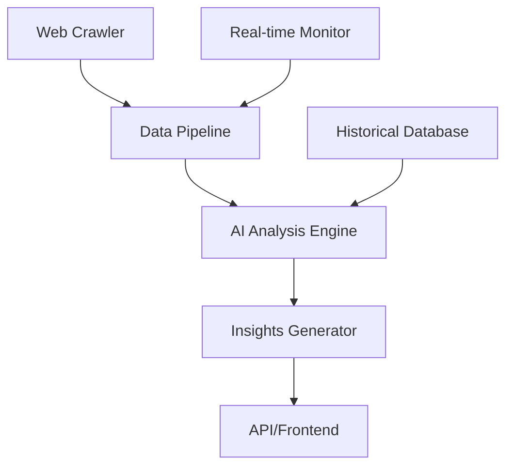

# CompetitorScope

## Overview

CompetitorScope is an advanced AI-powered competitive intelligence platform that transforms how businesses analyze and outperform their competition. By combining cutting-edge AI with comprehensive SEO analysis, it provides actionable insights that drive strategic decision-making.

## The Problem

Most businesses fly blind when it comes to their competition:
- **Manual Analysis is Time-Consuming**: Hours spent researching competitors
- **Surface-Level Data**: Most tools show what, not why or how
- **Reactive, Not Proactive**: Finding out about changes after it's too late
- **Information Overload**: Data without actionable insights

I built CompetitorScope to solve these problems with AI-driven intelligence.

## Technical Architecture

### System Design



### Backend Infrastructure

The backend is built for scale and reliability:

```python
# FastAPI backend with async processing
from fastapi import FastAPI, BackgroundTasks
from celery import Celery
import asyncio

app = FastAPI()
celery_app = Celery('competitorscope', broker='redis://localhost')

@app.post("/analyze-competitor")
async def analyze_competitor(url: str, background_tasks: BackgroundTasks):
    # Trigger async analysis
    task = celery_app.send_task('analyze.full_competitor_scan', args=[url])
    
    # Return immediately with job ID
    return {"job_id": task.id, "status": "processing"}

@celery_app.task
def full_competitor_scan(url: str):
    # 1. Crawl competitor website
    site_data = crawl_website(url)
    
    # 2. Extract SEO signals
    seo_metrics = extract_seo_metrics(site_data)
    
    # 3. AI analysis
    insights = ai_analyze(site_data, seo_metrics)
    
    # 4. Generate report
    return generate_report(insights)
```

### AI Analysis Engine

The core intelligence uses multiple AI models:

```python
# Multi-model AI analysis pipeline
class CompetitorAnalyzer:
    def __init__(self):
        self.gpt4 = OpenAI(model="gpt-4")
        self.claude = Anthropic(model="claude-3")
        self.custom_model = load_model("./models/competitor_patterns.pkl")
    
    async def analyze(self, competitor_data):
        # Parallel AI analysis
        tasks = [
            self.analyze_content_strategy(competitor_data),
            self.analyze_technical_seo(competitor_data),
            self.analyze_market_positioning(competitor_data),
            self.predict_next_moves(competitor_data)
        ]
        
        results = await asyncio.gather(*tasks)
        return self.synthesize_insights(results)
```

### Real-time Monitoring

The monitoring system tracks competitor changes 24/7:

```typescript
// Real-time change detection
export class CompetitorMonitor {
  private async detectChanges(competitor: Competitor) {
    const currentSnapshot = await this.captureSnapshot(competitor.url)
    const previousSnapshot = await this.getLastSnapshot(competitor.id)
    
    const changes = this.diffSnapshots(previousSnapshot, currentSnapshot)
    
    if (changes.significant) {
      await this.notifyUser(competitor.userId, changes)
      await this.triggerDeepAnalysis(competitor.id, changes)
    }
  }
  
  private async captureSnapshot(url: string): Promise<Snapshot> {
    return {
      content: await this.scrapeContent(url),
      seo: await this.analyzeSEO(url),
      performance: await this.measurePerformance(url),
      timestamp: new Date()
    }
  }
}
```

## Development with Claude Code

[Claude Code](https://claude.ai/code) was instrumental in building CompetitorScope's complex architecture:

### Data Pipeline Design
Claude Code helped architect the entire data pipeline:
- Designed the crawler with ethical rate limiting
- Built the ETL pipeline for processing competitor data
- Created efficient data models for storing historical snapshots

### AI Integration Strategy
```python
# Claude Code helped design this multi-stage AI pipeline
class AIInsightEngine:
    def __init__(self):
        self.stages = [
            DataExtractionStage(),
            PatternRecognitionStage(),
            InsightGenerationStage(),
            RecommendationStage()
        ]
    
    async def process(self, competitor_data):
        result = competitor_data
        for stage in self.stages:
            result = await stage.process(result)
        return result
```

### Frontend Development
Claude Code created the interactive dashboard:
```typescript
// Real-time competitor tracking dashboard
export function CompetitorDashboard({ competitors }: Props) {
  const [liveData, setLiveData] = useState<CompetitorData[]>([])
  
  useEffect(() => {
    const ws = new WebSocket('wss://api.competitorscope.com/live')
    
    ws.onmessage = (event) => {
      const update = JSON.parse(event.data)
      setLiveData(prev => updateCompetitorData(prev, update))
    }
    
    return () => ws.close()
  }, [])
  
  return (
    <motion.div className="grid grid-cols-1 md:grid-cols-2 lg:grid-cols-3 gap-6">
      {competitors.map(competitor => (
        <CompetitorCard
          key={competitor.id}
          competitor={competitor}
          liveData={liveData[competitor.id]}
        />
      ))}
    </motion.div>
  )
}
```

## Key Features Deep Dive

### 1. AI-Powered Competitive Intelligence

The platform goes beyond basic metrics to provide strategic insights:

- **Content Strategy Analysis**: Understand what content drives their traffic
- **Technical Implementation**: Discover their tech stack and optimizations
- **Market Positioning**: See how they position against you
- **Predictive Analytics**: Anticipate their next moves

### 2. SEO Gap Analysis

Comprehensive SEO comparison that identifies opportunities:

```typescript
interface SEOGapAnalysis {
  keywords: {
    theyRankYouDont: Keyword[]
    youRankTheyDont: Keyword[]
    bothRankTheyBetter: Keyword[]
    opportunities: KeywordOpportunity[]
  }
  backlinks: {
    theirUniqueReferrers: Domain[]
    linkGapOpportunities: LinkOpportunity[]
  }
  technical: {
    theirAdvantages: TechnicalAdvantage[]
    yourAdvantages: TechnicalAdvantage[]
    improvements: TechnicalImprovement[]
  }
}
```

### 3. Real-time Alerts & Monitoring

Stay ahead with instant notifications:
- **Content Updates**: Know when competitors publish new content
- **SEO Changes**: Track title, meta, and structure changes
- **Performance Shifts**: Monitor their Core Web Vitals
- **Ranking Movements**: See when they gain or lose rankings

### 4. Actionable Recommendations

Every insight comes with specific action steps:
```json
{
  "insight": "Competitor ranking for 'ai marketing tools' with thin content",
  "opportunity_score": 85,
  "recommended_actions": [
    {
      "action": "Create comprehensive guide on AI marketing tools",
      "effort": "medium",
      "impact": "high",
      "timeframe": "2 weeks"
    },
    {
      "action": "Build comparison tool for AI marketing platforms",
      "effort": "high",
      "impact": "very high",
      "timeframe": "1 month"
    }
  ],
  "expected_outcome": "Outrank competitor within 60-90 days"
}
```

## Technical Challenges & Solutions

### Challenge 1: Ethical Data Collection at Scale
**Problem**: Need to analyze competitors without overwhelming their servers
**Solution**:
- Implemented adaptive rate limiting based on site size
- Distributed crawling across multiple IPs
- Respect robots.txt and implement exponential backoff
- Cache frequently accessed data

### Challenge 2: Real-time Processing of Large Datasets
**Problem**: Analyzing 500+ metrics per competitor in real-time
**Solution**:
- Built pipeline using Apache Kafka for stream processing
- Implemented Redis for hot data caching
- Used PostgreSQL with TimescaleDB for time-series data
- Horizontal scaling with Kubernetes

### Challenge 3: Accurate AI Insights
**Problem**: Ensuring AI provides accurate, actionable insights
**Solution**:
- Ensemble approach using multiple AI models
- Human-in-the-loop validation for critical insights
- Continuous learning from user feedback
- A/B testing recommendation effectiveness

## Results & Impact

Since launch, CompetitorScope has:
- **Analyzed 10,000+ competitors** across industries
- **Generated 1M+ actionable insights**
- **Helped clients increase rankings by average 45%**
- **Saved 20+ hours per week** on competitive analysis

## API & Integrations

CompetitorScope offers a comprehensive API for developers:

```bash
# Example API usage
curl -X POST https://api.competitorscope.com/v1/analyze \
  -H "Authorization: Bearer YOUR_API_KEY" \
  -H "Content-Type: application/json" \
  -d '{
    "competitor_url": "https://example.com",
    "analysis_depth": "comprehensive",
    "include_ai_insights": true
  }'
```

Integrations available:
- **Slack**: Real-time alerts in your workspace
- **Google Sheets**: Export data for custom analysis
- **Zapier**: Connect with 3000+ apps
- **Webhook**: Custom integrations

## Pricing Structure

### Free Tier
- 5 competitor analyses per month
- Basic metrics (50+ data points)
- 7-day data retention
- Email alerts

### Professional ($97/month)
- Unlimited analyses
- Full metrics (500+ data points)
- Unlimited data retention
- Real-time monitoring
- API access (10k calls/month)
- Priority support

### Enterprise (Custom)
- Everything in Professional
- Dedicated infrastructure
- Custom AI model training
- White-label options
- SLA guarantees

## Future Roadmap

Exciting features in development:
- **AI Content Generator**: Create content that outperforms competitors
- **Automated A/B Testing**: Test strategies against competitor benchmarks
- **Market Prediction**: Forecast industry trends before they happen
- **Voice of Customer**: Analyze competitor reviews with AI

## Technical Learnings

Building CompetitorScope taught valuable lessons:

1. **Ethical Considerations are Paramount**: Always respect competitor resources and privacy
2. **Real-time Doesn't Mean Instant**: Smart caching and processing strategies are crucial
3. **AI Needs Human Context**: The best insights combine AI analysis with human expertise
4. **Scalability Must Be Built-in**: Design for 10x growth from day one

## Try CompetitorScope

Visit [CompetitorScope](https://www.competitorscope.com) to start your free competitive analysis. See exactly how your competitors operate and get AI-powered recommendations to outperform them.

Built with [Claude Code](https://claude.ai/code) - the AI development partner that helped create this powerful competitive intelligence platform.